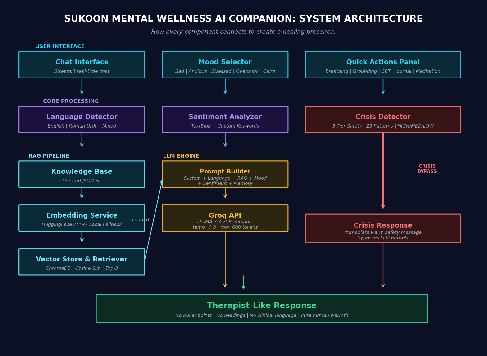
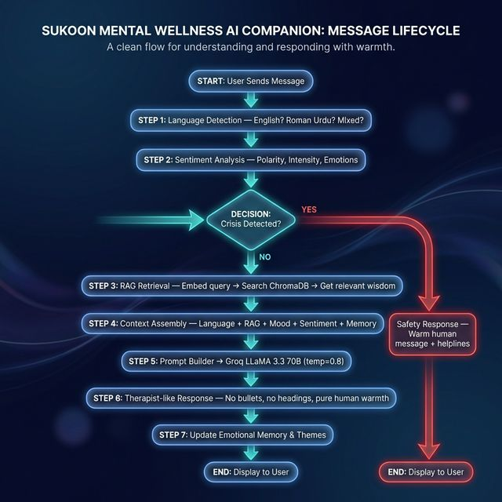

# Sukoon 🕊️

> *"Sukoon" means peace in Urdu. Everyone deserves a moment of calm.*

Hey there. 

If you're here, maybe you're looking for something that listens -- really listens. Not a chatbot that throws generic advice at you, but something that sits with you in whatever you're feeling.

That's what **Sukoon** is.

It's a **healing human presence in digital form**. Built with therapist-level emotional intelligence, it acknowledges your emotions, validates them, and gently offers support without rushing you, without fixing you, without sounding like a robot. Because sometimes, you don't need to be fixed. You just need to be heard.

---

## 💭 What Makes Sukoon Different?

Most chatbots feel... robotic. They give you bullet points. They sound like instruction manuals.

Sukoon doesn't do that.

**It responds like a trained human therapist who:**
- Sits with your emotion before trying to fix anything
- Acknowledges your pain before offering suggestions
- Validates your feelings before guiding
- Speaks softly, naturally, like a real person

It speaks in **English**, **Roman Urdu**, or **both mixed together** whatever feels natural to you. It detects your language automatically and mirrors your style.

And if things get heavy? Sukoon has built-in safety features that recognize when you might need real human support, and it gently points you there, like a friend, not an alarm.

---

## System Architecture



---

## Process Flow



---

## 🧠 How It Works (The Nerdy Stuff)

Under the hood, Sukoon uses something called **RAG** — Retrieval-Augmented Generation. In simple terms:

1. **It carries wellness wisdom.** There's a curated collection of grounding techniques, breathing exercises, and reflective insights stored in a local vector database (ChromaDB).

2. **It finds what's relevant to you.** When you share something, Sukoon searches for insights that match your emotional state using sentence embeddings.

3. **It weaves them into a human response.** Using a powerful language model (LLaMA 3.3 70B via Groq), it crafts a response that feels like a warm therapist, not a search result.

4. **It keeps you safe.** A 3-tier crisis detection system (29 regex patterns) runs quietly in the background. If it senses distress, it responds with extra care and shares helpline resources.

5. **It remembers your emotional context.** Conversation themes, emotional intensity, and hidden context are tracked across messages for therapist-like continuity.

---

## 🛠️ Project Structure

```
Sukoon-Mental-Wellness-Companion/
├── app.py                         # Main Streamlit application (671 lines)
├── config/
│   ├── __init__.py
│   └── settings.py                # Central config — model, moods, helplines, UI
├── prompts/
│   ├── __init__.py
│   └── templates.py               # Humanoid system prompt & healing behavior rules
├── rag/
│   ├── __init__.py
│   ├── embeddings.py              # HuggingFace API / local SentenceTransformers
│   ├── vector_store.py            # ChromaDB wrapper (cosine similarity)
│   ├── retriever.py               # Query → embed → search → format
│   └── knowledge_loader.py        # JSON → documents → embeddings → ChromaDB
├── utils/
│   ├── __init__.py
│   ├── sentiment.py               # TextBlob + custom keyword sentiment analysis
│   ├── crisis_detector.py         # 3-tier regex crisis detection (HIGH/MEDIUM/LOW)
│   ├── coping_techniques.py       # 33+ exercises: breathing, CBT, grounding, journal
│   └── language_detector.py       # English / Roman Urdu / Mixed detection (300+ words)
├── knowledge_base/
│   ├── breathing_techniques.json  # Guided breathing wisdom
│   ├── coping_strategies.json     # CBT-inspired thought reframing
│   ├── emotional_wisdom.json      # Emotional validation & perspective
│   ├── grounding_practices.json   # Sensory grounding techniques
│   └── mindfulness_practices.json # Journaling & self-compassion
├── chroma_db/                     # ChromaDB persistent vector storage
├── requirements.txt               # Python dependencies
├── .env                           # API keys (gitignored)
├── .env.example                   # Template for .env
└── .gitignore
```

---

## 🚀 Getting Started

### What You'll Need
- Python 3.10 or newer
- A free Groq API key (this powers Sukoon's brain)
- Optionally, a Hugging Face token (for faster cloud-based embeddings)

### Step 1: Grab the Code
```bash
git clone https://github.com/moiz-mansoori/Sukoon-Mental-Wellness-Companion.git
cd Sukoon-Mental-Wellness-Companion
```

### Step 2: Create Your Environment
```bash
python -m venv venv

# On Windows
.\venv\Scripts\activate

# On Mac/Linux
source venv/bin/activate
```

### Step 3: Install Everything
```bash
pip install -r requirements.txt
```

### Step 4: Add Your Keys
Create a file called `.env` in the main folder:

```text
# This one is required — get it free at https://console.groq.com
GROQ_API_KEY=your_groq_key_here

# This one is optional — get it free at https://huggingface.co/settings/tokens
# Skip it and Sukoon will use local embeddings instead (works fine, just slower startup)
HF_TOKEN=your_huggingface_token_here
```

### Step 5: Launch Sukoon
```bash
streamlit run app.py
```

That's it. Open your browser and start talking. 💙

---

## 🔄 About the Embedding System

Sukoon needs to understand your words deeply. It does this through "embeddings" — turning your message into something it can search against its knowledge base.

You have two options:

**With a Hugging Face token:** Sukoon uses the cloud. Faster startup, nothing to download.

**Without a token:** Sukoon runs locally using Sentence Transformers. It downloads a small model once, then works completely offline.

Either way, it just works. If the cloud fails, it falls back to local automatically.

---

## ⚙️ Tech Stack

| Component | Technology | Purpose |
|---|---|---|
| **Frontend** | Streamlit | Chat UI with custom dark theme |
| **LLM** | LLaMA 3.3 70B via Groq | Therapist-like response generation |
| **Embeddings** | all-MiniLM-L6-v2 | 384-dim sentence embeddings |
| **Vector DB** | ChromaDB | Persistent local vector storage |
| **Sentiment** | TextBlob + custom keywords | Emotional state detection |
| **Language** | Custom detector (300+ words) | English / Roman Urdu / Mixed |
| **Crisis Safety** | 3-tier regex engine | 29 patterns across 3 severity levels |

---

## 💆 Quick Actions

Sometimes you don't want to type. Sukoon has one-click buttons for:

- 🌬️ **Breathing exercises** — Slow down with guided breathing
- 🌍 **5-4-3-2-1 Grounding** — Come back to the present moment
- 💭 **Thought reframing** — Gently shift your perspective
- 📝 **Journal prompts** — Reflect on what's on your mind
- ✨ **Affirmations** — Kind words when you need them
- 🧘 **Quick meditation** — A moment of stillness

---

## ☁️ Deploying to the Cloud

Want to share Sukoon with others? You can deploy it on Streamlit Cloud for free:

1. Push your code to GitHub
2. Visit [share.streamlit.io](https://share.streamlit.io)
3. Connect your repo
4. Add your secrets in the dashboard:
   ```
   GROQ_API_KEY = "your_key"
   HF_TOKEN = "your_token"  # optional
   ```

---

## A Gentle Reminder

Sukoon is a companion, not a replacement for professional help.

If you're going through something serious, please reach out to a therapist, counselor, or crisis helpline. You deserve real, human support.

This tool is here to sit with you in the in-between moments. To help you breathe. To remind you that your feelings are valid.

---

## 🌱 The Philosophy

Mental wellness isn't about fixing yourself. It's about finding small moments of peace amidst the chaos.

Sukoon is built on one belief: **healing comes from presence, not instructions.**

It doesn't lecture. It doesn't rush. It just listens deeply, softly, like someone who truly cares.

Take care of yourself. You matter. 

---

## 🤝 Want to Contribute?

This project is open source. If you'd like to help make Sukoon better:

- Add more wellness content to the knowledge base
- Improve language detection for more languages
- Enhance crisis detection patterns
- Make the UI even more calming

All contributions are welcome.

---

*Made with 💙 by Moiz Ahmed Mansoori*
